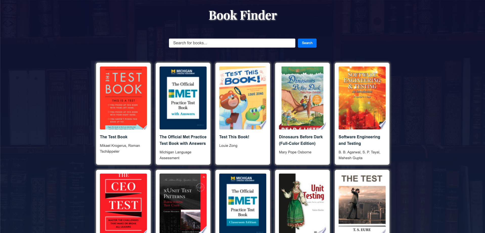
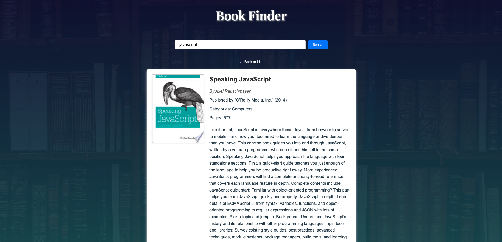

# Book Finder App

A modern web application built with Angular that allows users to search and explore books using the Google Books API.




## Features

- Real-time book search using Google Books API
- Responsive grid layout for search results
- Detailed view for each book
- Clean and modern UI design
- State persistence for search results



## Project Structure

```
src/
├── app/
│   ├── components/
│   │   ├── book-list/
│   │   ├── book-detail/
│   │   └── search-bar/
│   ├── services/
│   │   └── book.service.ts
│   └── models/
│       └── book.interface.ts
```

## Development server

To start a local development server, run:

```bash
ng serve
```

Once the server is running, open your browser and navigate to `http://localhost:4200/`. The application will automatically reload whenever you modify any of the source files.

## Code scaffolding

Angular CLI includes powerful code scaffolding tools. To generate a new component, run:

```bash
ng generate component component-name
```

For a complete list of available schematics (such as `components`, `directives`, or `pipes`), run:

```bash
ng generate --help
```

## Building

To build the project run:

```bash
ng build
```

This will compile your project and store the build artifacts in the `dist/` directory. By default, the production build optimizes your application for performance and speed.

## Running unit tests

To execute unit tests with the [Karma](https://karma-runner.github.io) test runner, use the following command:

```bash
ng test
```

# cricut-assessment
